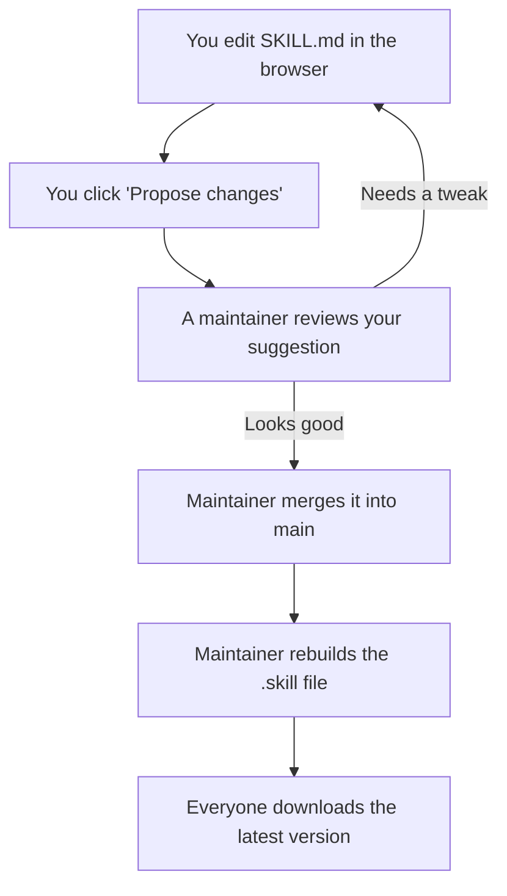

# Working on this skill together

A plain-English guide for improving the human-voice skill as a group. You do not need to know GitHub, install anything, or use a command line. Everything here happens in your web browser.

## The one rule that keeps this simple

**`SKILL.md` is the file we edit. `human-voice-v1.skill` is the packaged version nobody edits by hand.**

`SKILL.md` is plain text you can read and change. The `.skill` file is a zipped copy that an AI agent loads when it runs the skill. A maintainer rebuilds that zip from `SKILL.md` whenever the text changes. So if you want to change how the skill behaves, you change `SKILL.md` and leave the `.skill` file alone.

## First time here? Two-minute setup

This repo is private, so you have to be invited before you can see or edit it.

1. Create a free account at [github.com](https://github.com) if you don't have one.
2. Send Eddie your GitHub username.
3. He adds you to the repo, and you get an email invitation. Click **Accept** in that email.

Once you've accepted, you can read everything and suggest changes.

## Who does what

- **Maintainer** (Eddie, plus one technical helper): reviews suggested changes, approves them, and rebuilds the `.skill` file. Has the final say on what goes in.
- **Everyone else, including you:** read the skill, suggest changes to `SKILL.md`, and comment on each other's suggestions.

## How a change flows

The short version: you suggest, a maintainer reviews and approves, the packaged file gets rebuilt, and everyone can pull the new version.

## Just want to read or use the skill? (Download)

- **To read it:** click `SKILL.md` in the file list. GitHub shows it nicely formatted.
- **To download the skill file for an agent:** click `human-voice-v1.skill`, then the **Download raw file** button (the download icon near the top right of the file box). Save it where you'll find it.
- **To download everything at once:** on the repo's main page, click the green **Code** button, then **Download ZIP**.

## Want to suggest a change? (Edit in the browser, the easy way)

1. Open `SKILL.md` by clicking its name.
2. Click the **pencil icon** near the top right of the file (it says "Edit this file" when you hover). If GitHub asks anything, go ahead; you're allowed.
3. Make your edits in the text box. It's ordinary writing with a few `#` headings and `-` bullets. Type the way you would anywhere.
4. Click the green **Commit changes...** button near the top right.
5. A box appears. In the message, write a short note like "Add a tell about buzzwords" so others know what you did.
6. Choose **Create a new branch for this commit and start a pull request.** This keeps the shared version safe until someone reviews yours.
7. Click **Propose changes**, then on the next screen click **Create pull request.**

That's the whole thing. A maintainer gets notified, reads your suggestion, and either approves it or leaves a comment with a question.

## Prefer to write in your own app? (Upload)

If you'd rather draft in a text editor:

1. Download `SKILL.md` first (see above) and edit your copy. Keep the file name exactly `SKILL.md`.
2. On the repo's main page, click **Add file**, then **Upload files.**
3. Drag your edited `SKILL.md` into the page. Because it has the same name, it replaces the old one.
4. Scroll down, choose **Create a new branch for this commit and start a pull request**, and add a short message.
5. Click **Propose changes**, then **Create pull request.**

One caution: writing apps like Word can silently add smart quotes and stray formatting. Editing directly in the browser (the section above) is safer. If you do use an outside app, a plain-text editor is best.

## After you propose a change

- A maintainer reviews your pull request. They may approve it as-is or comment with a question. You get an email either way, and you can reply right on the pull request page.
- Once it's approved and merged, your words are part of `SKILL.md`.
- A maintainer then rebuilds `human-voice-v1.skill` so the packaged version matches. You don't do this step.
- To get the latest version for yourself, download it again. The file updates in place.

## GitHub words, in plain English

- **Repository (repo):** this project's folder of files. You're looking at it.
- **main:** the official, current version everyone shares.
- **Commit:** one saved change with a short note attached to it.
- **Branch:** a separate copy where your change lives until it's approved, so `main` stays safe in the meantime.
- **Pull request (PR):** your suggestion, packaged up for review. The name means "please pull my change into the shared version."
- **Merge:** approving a pull request so its changes join `main`.
- **Maintainer:** someone allowed to approve and merge.

## For maintainers (the one technical part)

After a change is merged into `main`, the packaged `.skill` needs to be rebuilt so it matches `SKILL.md`. Two ways:

- **With the repo on your computer:** pull the latest, run `./build-skill.sh` from the repo root, then commit the updated `human-voice-v1.skill`.
- **Or ask Claude Code** to rebuild and push it.

To add a collaborator: go to the repo's **Settings**, then **Collaborators**, then **Add people**, and enter their GitHub username.

Optional but recommended once a few people are involved: turn on branch protection for `main` (Settings, then Branches) so every change goes through a pull request and nothing lands on `main` by accident.
